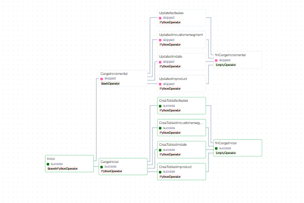
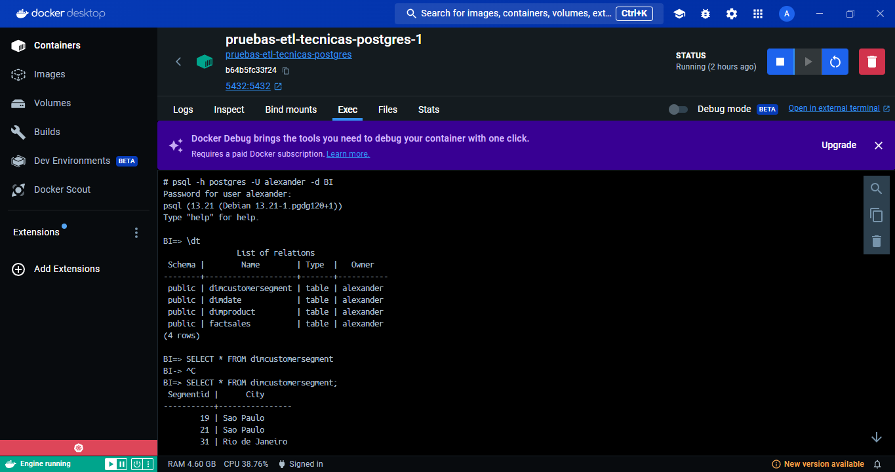
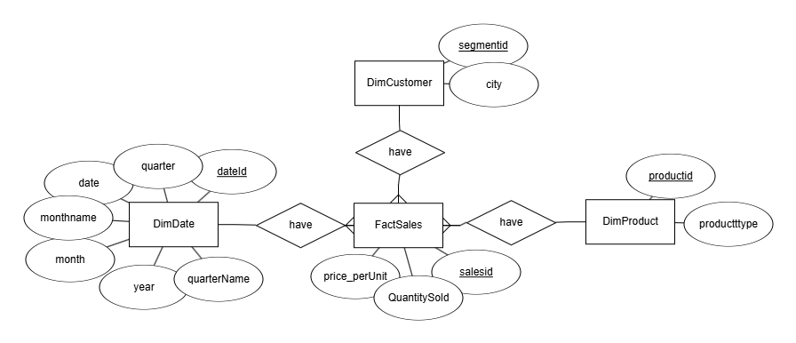
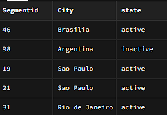
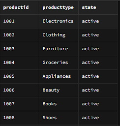
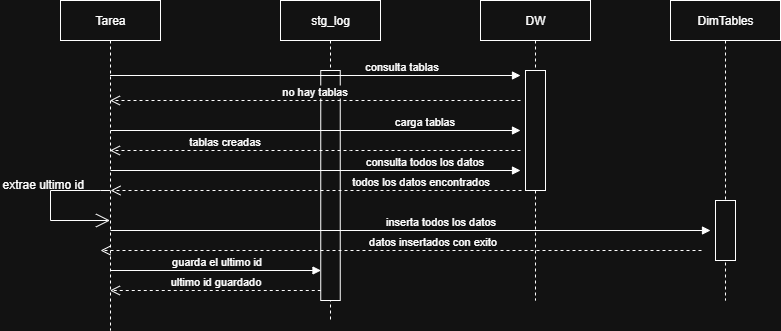
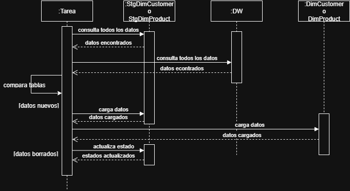
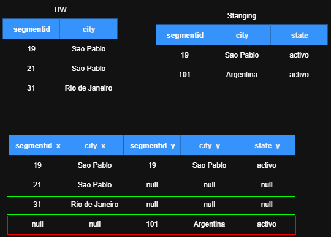

# 🧪 Ejercicio 1 – Replicación de Base de Datos (PostgreSQL → Supabase)

Este módulo resuelve el primer ejercicio de la prueba técnica: replicar datos desde una base transaccional en PostgreSQL hacia una base espejo en la nube (Supabase), con automatización diaria.

---

## 🧠 ¿Qué pedía el ejercicio?

La empresa ya cuenta con una base de datos transaccional que registra ventas y productos. Lo que necesitan es una **copia diaria de esa información** en la nube, para usarla con fines de análisis.

> Mi enfoque fue crear una carga inicial y luego una carga incremental eficiente. Evitar hacer un full refresh todos los días es clave para no sobrecargar el sistema.

---

## 🧱 Paso 1: Crear el contenedor de PostgreSQL

Se levantó un contenedor de PostgreSQL en Docker y se configuró con una **red interna (`bridge`)**. Esto significa que **solo los servicios corriendo dentro del entorno de Docker pueden acceder al Data Warehouse**.

> Se uso para limitar el acceso, y es una buena práctica de encapsulamiento de red para que se comuniquen mis servicios.

---

## 📥 Paso 2: Leer los datos desde la base origen

Usé `pandas` para leer los CSV y transformarlos en `DataFrames`. Luego, con `sqlalchemy` + `pymysql` creé una conexión entre el contenedor de Python y el contenedor de PostgreSQL.

> Como ambos contenedores están en la misma red, la conexión fue directa y sin exponer puertos públicos.

```python
df = pd.read_csv(f)# f es el .csv
df.columns = [col.lower() for col in df.columns]#Para mas control convertimos las columnas a minusculas 
table_name = os.path.splitext(os.path.basename(f))[0].lower()#toma el nombre del archivo como nombre de la tabla
df.to_sql(table_name, engine, if_exists='replace', index=False)
```

Los archivos CSV utilizados fueron mapeados y cargados en el volumen para poder usarlos

📸 Al ejecutar el dag sigue el siguiente flujo con exito:

> Si `la base de datos creada` esta vacia, el script asume que es la **primera carga**. Si ya tiene datos, realiza una carga **incremental**, ahorrando recursos.




Resultado: 



---

## ☁️ Paso 3: Replicar la base en la nube (Supabase)

Antes se debe crear un proyecto en Supabase, con las tablas cargadas previamente respetando el modelo estrella. Este fue el modelo lógico interpretado:

```
DimProduct(productid PK, producttype)
DimCustomer(segmentid PK, city)
DimDate(dateid PK, quarter, date, monthname, month, year, quartername)
FactSales(saleid PK, segmentid FK, productid FK, dateid FK, price_per_unit, quantity_sold)
```

📸 MER:



---

## 🛠️ Tablas auxiliares:
Realizaremos Cargas Incrementales para una mejor eficiencia del codigo ya que se realizan copias todos los dias

### `stg_log`
Esta tabla guarda registros de cuándo se hizo la última carga, qué tabla se actualizó y cuál fue el último ID.

---

### `stg_customersegment` y `stg_product`

Estas dos tablas permiten detectar cambios en los datos de dimensiones.Comparo los registros nuevos y guardo un `estado` (activo/inactivo).

> Esto es util si borraron datos en origen. Asi evito romper la tabla `factsales`, que necesita esas claves foraneas.

📸

  
---

## 🔄 Flujo general del script
### Carga inicial


### Tablas DimDate y FactSales
### Carga incremental 


### Tablas DimCustomers y DimProductos
### Carga Incremental



### Explicacion del script de comparacion:
Se realiza un **full outer join**, lo que permite identificar que datos de la primera tabla no estan en la segunda y viceversa.


 
---


## 📅 Automatización con Airflow

El DAG corre todos los días y sigue el flujo dectectando la carga incial(solo una vez) o la carga incremental(n)

> Aunque podría no ser estrictamente necesario la columna fecha de la tabla `stg_log` me sirve para monitorear que todo corrió bien asegurando que airflow corrio cada dia.

