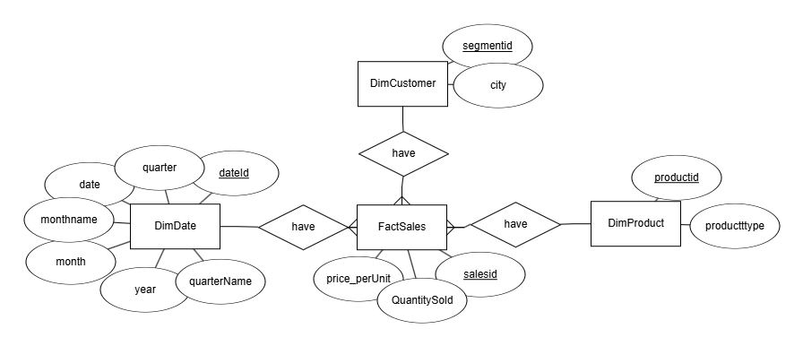
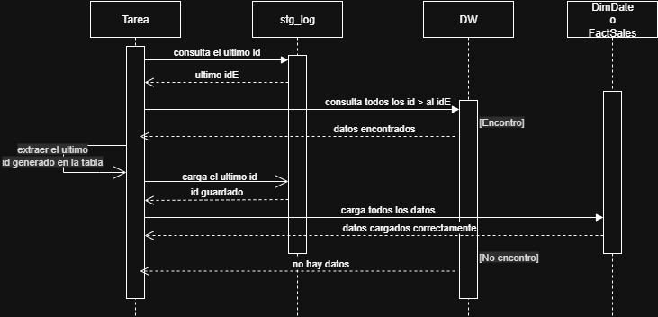
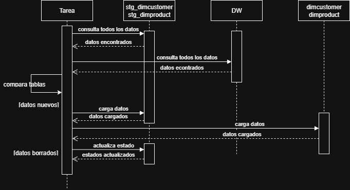

# 🧪 Ejercicio 1 – Replicación de Base de Datos (PostgreSQL → Supabase)

Este módulo resuelve el primer ejercicio de la prueba técnica: replicar datos desde una base transaccional en PostgreSQL hacia una base espejo en la nube (Supabase), con automatización diaria.

---

## 🧠 ¿Qué pedía el ejercicio?

La empresa ya cuenta con una base de datos transaccional que registra ventas y productos. Lo que necesitan es una **copia diaria de esa información** en la nube, para usarla con fines de análisis.

> Mi enfoque fue crear una carga inicial y luego una carga incremental eficiente. Evitar hacer un full refresh todos los días es clave para no sobrecargar el sistema.

---

## 🧱 Paso 1: Crear el contenedor de PostgreSQL

Se levantó un contenedor de PostgreSQL en Docker y se configuró con una **red interna (`bridge`)**. Esto significa que **solo los servicios corriendo dentro del entorno de Docker pueden acceder al Data Warehouse**.

> Se uso para limitar el acceso, y es una buena práctica de encapsulamiento de red para que se comuniquen mis servicios.

---

## 📥 Paso 2: Leer los datos desde la base origen

Usé `pandas` para leer los CSV y transformarlos en `DataFrames`. Luego, con `sqlalchemy` + `pymysql` creé una conexión entre el contenedor de Python y el contenedor de PostgreSQL.

> Como ambos contenedores están en la misma red, la conexión fue directa y sin exponer puertos públicos.

```python
df = pd.read_csv(f)# f es el .csv
df.columns = [col.lower() for col in df.columns]#Para mas control convertimos las columnas a minusculas 
table_name = os.path.splitext(os.path.basename(f))[0].lower()#toma el nombre del archivo como nombre de la tabla
df.to_sql(table_name, engine, if_exists='replace', index=False)
```

Los archivos CSV utilizados fueron mapeados y cargados en el volumen para poder usarlos

📸 Al ejecutar el dag sigue el siguiente flujo con exito:

> Si `la base de datos creada` esta vacia, el script asume que es la **primera carga**. Si ya tiene datos, realiza una carga **incremental**, ahorrando recursos.


Resultado: 

 CAMBIAR

---

## ☁️ Paso 3: Replicar la base en la nube (Supabase)

Antes se debe crear un proyecto en Supabase, con las tablas cargadas previamente respetando el modelo estrella. Este fue el modelo lógico interpretado:

```
DimProduct(productid PK, producttype)
DimCustomer(segmentid PK, city)
DimDate(dateid PK, quarter, date, monthname, month, year, quartername)
FactSales(saleid PK, segmentid FK, productid FK, dateid FK, price_per_unit, quantity_sold)
```

📸 MER:



---

## 🛠️ Tablas auxiliares:
Realizaremos Cargas Incrementales para una mejor eficiencia del codigo ya que se realizan copias todos los dias

### `StgLog`
Esta tabla guarda registros de cuándo se hizo la última carga, qué tabla se actualizó y cuál fue el último ID.

---

### `StgCustomer` y `StgProduct`

Estas dos tablas permiten detectar cambios en los datos de dimensiones.Comparo los registros nuevos y guardo un `estado` (activo/inactivo).

> Esto es util si borraron datos en origen. Asi evito romper la tabla `FactSales`, que necesita esas claves foraneas.

📸

  CAMBIAR
---

## 🔄 Flujo general del script
### Carga inicial
 CAMBIAR

### Tablas DimDate y FactSales
### Carga incremental 



### Tablas DimCustomers y DimProductos
### Carga Incremental



### Explicacion del script de comparacion:

Se realiza un full-other join esto me permite identificar que datos de de la primera tabla no estan en la segunda y que datos de la segunda no estan en la primera 

Pandas agrega una columna _merge para ver si realizo un lef,right o full join,voy aprovechar eso ya que estamos :)

Para los datos nuevos filtraria el merge con left es la tabla origen que no hizo match con la tabla Stanging
 CAMBIAR

Para los datos borrados filtraria el merge con right es la tabla Stanging que no hizo match con la tabla origen
 CAMBIAR

---


## 📅 Automatización con Airflow

El DAG corre todos los días y sigue el flujo dectectando la carga incial(solo una vez) o la carga incremental(n)

> Aunque podría no ser estrictamente necesario la columna fecha de la tabla `stglog` me sirve para monitorear que todo corrió bien asegurando que airflow corrio cada dia.

---

## 🧪 Lote de prueba

Se cargan todos los csv en postgres y supabase:

📸

 CAMBIAR

La base de datos ya esta cargado por lo cual el flujo para la siguiende condicion actua asi:

📸

 CAMBIAR

---

## ✅ Conclusión

Este pipeline permite una replicación confiable y controlada:
- Evita full refresh innecesarios
- Detecta borrados lógicos
- Deja trazabilidad
- Es liviano para correr a diario
