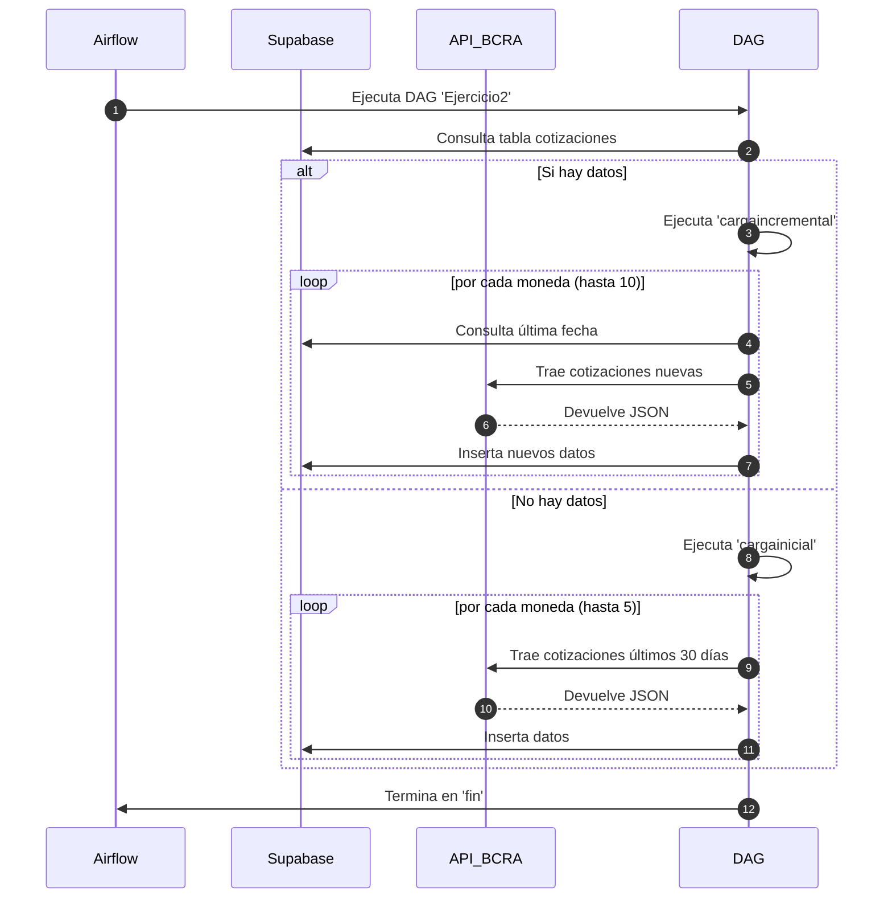

# 🧪 Ejercicio 2 – Consumo de API del BCRA y carga incremental en Supabase

Este módulo resuelve el segundo ejercicio de la prueba técnica: **extraer datos de cotizaciones de monedas desde la API pública del BCRA**, normalizarlos y almacenarlos en Supabase, con una automatización semanal vía Airflow.

---

## 🧠 ¿Qué pedía el ejercicio?

Extraer información histórica de tipo de cambio desde una fuente pública (API del BCRA) y almacenarla en una base nube.

Mi enfoque fue diseñar una estrategia que detecte si ya existen datos cargados por moneda, y en función de eso, decidir si hacer:

- 🔄 **Carga inicial**: últimos 30 días (para no saturar)
- ♻️ **Carga incremental**: desde la última fecha cargada

---

## 🧩 Diseño general

- 📡 **Fuente**: API pública del BCRA (`/Cotizaciones/{moneda}`)
- 🧰 **Proceso**: Normalización de datos, control de duplicados, carga por lotes (`batch`)
- ☁️ **Destino**: Tabla `cotizaciones` en Supabase
- 🔁 **Orquestación**: DAG de Airflow semanal

---

## 🛠️ Estructura de la tabla destino

```sql
cotizaciones (
    moneda TEXT,
    tipo_cambio FLOAT,
    fecha DATE
)
```

La normalización asegura que:

- Se ignoren entradas sin `detalle`
- Se filtren cotizaciones con valor 0
- Los datos estén listos para análisis directo

---

## ⚙️ Lógica de carga

### 🔄 Normalización

```python
def normalizar(registro):
    if not registro.get('detalle'):
        return None
    detalle = registro['detalle'][0].copy()
    tipo_cambio = float(detalle['tipoCotizacion'])
    if tipo_cambio == 0:
        return None
    return {
        'moneda': detalle['codigoMoneda'],
        'tipo_cambio': tipo_cambio,
        'fecha': registro['fecha']
    }
```

---

### 🚀 Carga inicial

Consulta los últimos 30 días para las primeras 5 monedas.

```python
divisas = requests.get(url_divisas).json()['results']
for i, moneda in pd.DataFrame(divisas).head(5).iterrows():
    historial = get_api(fechadesde, fechahasta, moneda['codigo'])
    loadsupabase(pd.DataFrame(historial))
```

> Se activa si **la tabla está vacía**

---

### ♻️ Carga incremental

Para cada moneda, consulta la última fecha cargada y pide datos nuevos.

```python
fecha_desde = supabase.table('cotizaciones')\
    .select("fecha")\
    .eq("moneda", moneda['codigo'])\
    .order("fecha", desc=True)\
    .limit(1)\
    .execute()
```

> Recorre hasta **10 monedas** para validar escalabilidad

---

## 📅 Automatización con Airflow

El DAG corre cada lunes a las 00:00. El flujo general es:

1. **Inicio**: Detecta si hay datos en Supabase
2. Si hay → `cargaincremental`
3. Si no hay → `cargainicial`
4. Cierra en `fin`

```python
inicio >> [inicial, incremental]
[inicial, incremental] >> fin
```

### `schedule_interval`

```python
schedule_interval='0 0 * * 1'  # lunes 00:00
```

---

## 📈 Diagrama de Secuencia – Flujo del DAG



---

## 📊 Observabilidad y Logs

Durante la ejecución:

- Se imprime la fecha `desde/hasta` de cada consulta
- Se muestra el contenido recibido desde la API
- Se loguean errores por moneda si los hay
- Se puede monitorear desde la UI de Airflow

---

## ✅ Conclusión

Este pipeline permite:

- Mantener actualizada una base nube a partir de datos públicos
- Detectar automáticamente si es necesario cargar desde cero o continuar
- Tener una estructura fácil de extender con nuevas monedas o nuevas APIs
- Apoyarse en Airflow para trazabilidad, control de errores y reintentos

---
