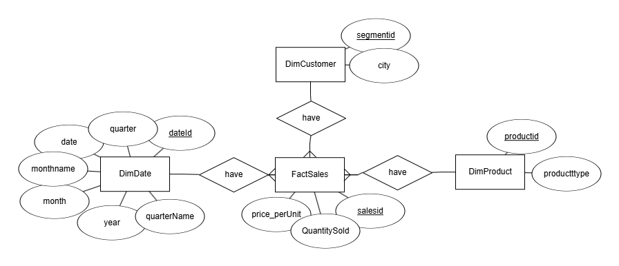
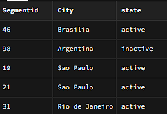
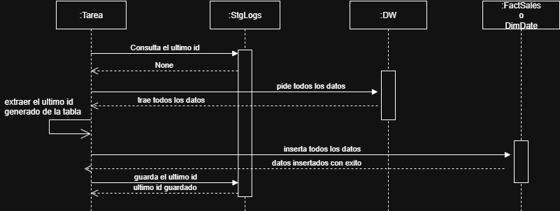
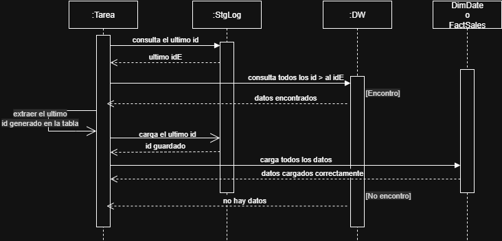

# 🧪 Ejercicio 1 – Replicación de Base de Datos (PostgreSQL → Supabase)

Este módulo resuelve el primer ejercicio de la prueba técnica: replicar datos desde una base transaccional en PostgreSQL hacia una base espejo en la nube (Supabase), con automatización diaria.

---

## 🧠 ¿Qué pedía el ejercicio?

La empresa ya cuenta con una base de datos transaccional que registra ventas y productos. Lo que necesitan es una **copia diaria de esa información** en la nube, para usarla con fines de análisis.

> Mi enfoque fue crear una carga inicial y luego una carga incremental eficiente. Evitar hacer un full refresh todos los días es clave para no sobrecargar el sistema.

---

## 🧱 Paso 1: Crear el contenedor de PostgreSQL

Se levantó un contenedor de PostgreSQL en Docker y se configuró con una **red interna (`bridge`)**. Esto significa que **solo los servicios corriendo dentro del entorno de Docker pueden acceder al Data Warehouse**.

> Se uso para limitar el acceso, y es una buena práctica de encapsulamiento de red para que se comuniquen mis servicios.

---

## 📥 Paso 2: Leer los datos desde la base origen

Usé `pandas` para leer los CSV y transformarlos en `DataFrames`. Luego, con `sqlalchemy` + `pymysql` creé una conexión entre el contenedor de Python y el contenedor de PostgreSQL.

> Como ambos contenedores están en la misma red, la conexión fue directa y sin exponer puertos públicos.

```python
df = pd.read_csv("csv/FactSales.csv")
df.to_sql("FactSales", con=engine, if_exists="replace", index=False)
```

Los archivos CSV utilizados fueron:

- [`DimDate.csv`](https://cf-courses-data.s3.us.cloud-object-storage.appdomain.cloud/-omGFpVSWBIZKFSCxUkBwg/DimDate.csv)
- [`DimCustomerSegment.csv`](https://cf-courses-data.s3.us.cloud-object-storage.appdomain.cloud/h_dnxb8yzQyVjeb8oYnm8A/DimCustomerSegment.csv)
- [`DimProduct.csv`](https://cf-courses-data.s3.us.cloud-object-storage.appdomain.cloud/Y-76u4An3zb5R6HxxFPabA/DimProduct.csv)
- [`FactSales.csv`](https://cf-courses-data.s3.us.cloud-object-storage.appdomain.cloud/a8kTjzvpdqzOp46ODatyAA/FactSales.csv)

📸 Despues de haber ejecutado el script se puede apreciar las tablas creadas y sus datos:


---

## ☁️ Paso 3: Replicar la base en la nube (Supabase)

Antes se debe crear un proyecto en Supabase, con las tablas cargadas previamente respetando el modelo estrella. Este fue el modelo lógico interpretado:

```
DimProduct(productid PK, producttype)
DimCustomer(segmentid PK, city)
DimDate(dateid PK, quarter, date, monthname, month, year, quartername)
FactSales(saleid PK, segmentid FK, productid FK, dateid FK, price_per_unit, quantity_sold)
```

📸 MER:



---

## 🛠️ Tablas auxiliares:
Realizaremos Cargas Incrementales para una mejor eficiencia del codigo ya que se realizan copias todos los dias

### `StgLog`


Esta tabla guarda registros de cuándo se hizo la última carga, qué tabla se actualizó y cuál fue el último ID.

> Si `StgLog` está vacía, el script asume que es la **primera carga**. Si ya tiene datos, realiza una carga **incremental**, ahorrando recursos.

📸


---

### `StgCustomer` y `StgProduct`

Estas dos tablas permiten detectar cambios en los datos de dimensiones. En lugar de hacer un full refresh, comparo los registros nuevos y guardo un `estado` (activo/inactivo).

> Esto es útil si borraron datos en origen. Así evito romper la tabla `FactSales`, que necesita esas claves foráneas.

📸

 

---

## 🔄 Flujo general del script

### Tablas DimDate y FactSales
### Carga inicial



### Carga incremental 





### Tablas DimCustomers y DimProductos
### Carga inicial


### Carga incremental 


---


## 📅 Automatización con Airflow

El DAG corre todos los días y sigue esta lógica:

1. Consulta `StgLog`
2. Detecta si hay nuevas filas
3. Inserta lo nuevo
4. Actualiza `StgLog` al final

> Aunque podría no ser estrictamente necesario, actualizar `StgLog` me sirve para monitorear que todo corrió bien asegurando que airflow corrio cada dia.

---

## 🧪 Lote de prueba

Se insertó una fila manual en `FactSales`:

📸


Y al día siguiente, el proceso la detectó e insertó correctamente en Supabase:

📸


---

## ✅ Conclusión

Este pipeline permite una replicación confiable y controlada:

- Evita full refresh innecesarios
- Detecta borrados lógicos
- Deja trazabilidad
- Es liviano para correr a diario